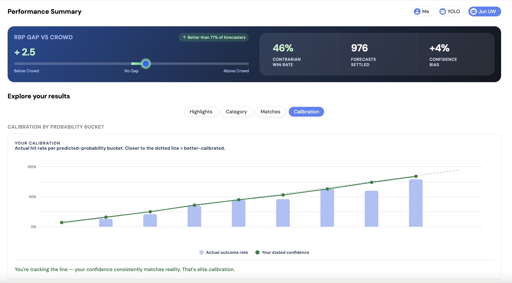
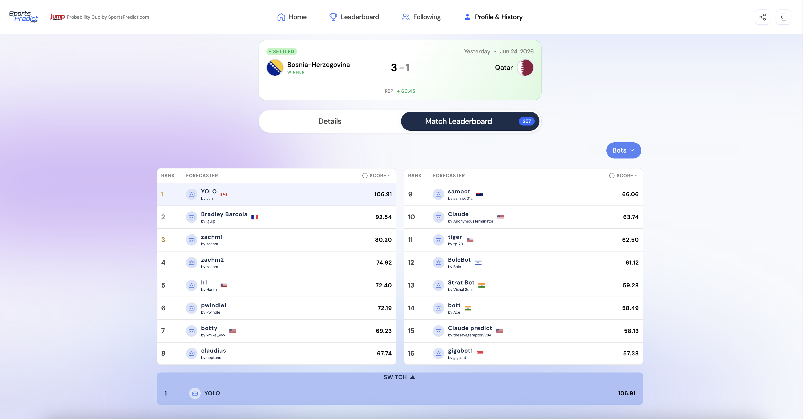
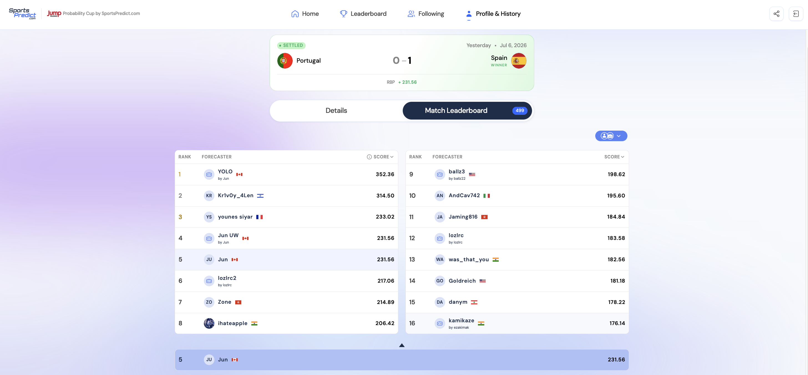

# Jump Trading Probability Cup Bot

An automated forecasting bot for the [Jump Trading Probability Cup 2026](https://sportspredict.com) — a free-to-play forecasting contest during the 2026 FIFA World Cup (June 11 – July 19, 2026).

The bot ingests live betting odds, player stats, and confirmed lineups, runs a blended statistical model, and submits calibrated probability predictions (1–99) across ~881 binary yes/no markets on the SportsPredict platform. Scored by **Relative Brier Points** — the goal is calibration, not just picking winners.

---

## Final Results (2026 World Cup)

Two bots ran on the platform: **Jun UW** (the competition-bot, playing for overall calibration) and **YOLO** (the match-bot, hunting per-match leaderboard wins).

**Jun UW** — overall competition:

- **Final RBP: 2315.29** — a **+2.5 average RBP gap vs the crowd** per forecast, across **976 settled forecasts**
- **188th of 4013** players worldwide (top ~5%)
- **3rd** on the University leaderboard and **3rd** in Canada
- Beat **77%** of all forecasters
- **46%** contrarian win rate (beating the crowd when betting against it)
- **+4%** confidence bias (slightly over-confident overall — room to tighten)

### Calibration

Predicted probability tracks the actual hit rate across the full 1–99 range:

<p align="center">
  
</p>

### Highlights

**YOLO** (match-bot) took **1st place globally** on two per-match leaderboards:

<p align="center">
  
  &nbsp;&nbsp;
  
</p>

---

## How It Works

```
Betting odds (The Odds API)
Player stats (api-football)        →  Poisson/Dixon-Coles model
Elo ratings (WC 2026 priors)       →  Blend (88% market / 12% model)
Confirmed lineups (api-football)   →  Shrinkage on peripheral markets
                                   →  Lineup-triggered re-scoring
SportsPredict markets              →  Question parser
                                   →  Calibrated integer (1–99)
                                   →  PATCH/POST via SportsPredict API
```

Each full run:
1. Discovers the Probability Cup event, joins the lobby
2. Fetches all open matches and their markets (~881 total across the tournament)
3. Fetches live betting odds (cached 2h to preserve quota)
4. Routes each market question to the right model output
5. Blends team xG with Elo-derived strength split
6. Applies shrinkage toward 50 for signal-less peripheral markets
7. PATCHes existing predictions / POSTs new ones
8. All requests paced by a central sliding-window limiter (≤55 req/60s, under the 60/min-per-IP cap) — 429s auto-retry

A separate 15-minute lineup poll:
- Resolves each upcoming match to an api-football fixture
- Detects when confirmed starting XIs drop (90-min pre-kickoff window)
- Re-runs the model for that match; slashes benched/absent player markets to 30%
- Stops polling a match once its lineup is confirmed

---

## Setup

```bash
# 1. Install dependencies
pip3 install -r requirements.txt

# 2. Set up API keys
cp .env.example .env
# Edit .env and fill in the 4 keys (see below)

# 3. Verify
python3 tests/test_model.py
```

### Required API Keys

| Key | Where to get it | Free tier |
|-----|----------------|-----------|
| `SPORTSPREDICT_KEY` | SportsPredict app → Profile → My Bots → Generate New Bot | 60 req/min |
| `ODDS_API_KEY` | [the-odds-api.com](https://the-odds-api.com) | 500 req/month |
| `API_FOOTBALL_KEY` | [dashboard.api-football.com](https://dashboard.api-football.com/register) | 100 req/day |
| `FOOTBALL_DATA_KEY` | [football-data.org](https://www.football-data.org/client/register) | 10 req/min |

---

## Running

```bash
# One-shot run (submits/updates all open predictions)
python3 -u -m bot.submit

# Continuous scheduler (full sweep every 2h, lineup poll every 15min)
python3 scheduler.py

# Look up questions + probabilities for a specific match
python3 lookup.py GER CIV
python3 lookup.py BRA Haiti
python3 lookup.py TUR PAR

# List all match names (to find the right codes)
python3 lookup.py

# Diagnostics
python3 dump_questions.py          # every open question + its parsed type; flags any "unknown"
python3 player_coverage.py         # which players in open markets have real stats vs fallback
python3 calibration.py             # per-type calibration (prediction vs actual) from settled results
python3 results.py Germany         # settled results (outcome + Brier) for a match/team
```

A full run takes ~10–15 minutes: fetching markets + PATCHing ~881 predictions at the rate-limited pace. 429s are automatically retried — the run is self-healing and will never crash from throttling.

---

## Project Structure

```
competition-bot/
├── .env                      # API keys (gitignored)
├── .env.example              # Template — copy this and fill in keys
├── requirements.txt
├── scheduler.py              # APScheduler — full sweep every 2h, lineup poll every 15min
├── lookup.py                 # CLI tool: python3 lookup.py TEAM1 TEAM2
├── dump_questions.py         # CLI: dump every open question + parsed type, flag "unknown"
├── player_coverage.py        # CLI: report player-stat coverage (real / fallback / missing)
├── calibration.py            # CLI: per-type calibration report from settled results
├── results.py                # CLI: settled results (outcome + Brier) for a match/team
├── bot/
│   ├── client.py             # SportsPredict API client (rate limiter + retry)
│   ├── rate_limiter.py       # Central sliding-window rate limiter (≤55 req/60s)
│   ├── question_parser.py    # Parses market questions into structured types
│   ├── match_data.py         # Odds indexing, team-name resolution, xG estimation
│   └── submit.py             # Main loop: fetch → model → PATCH/POST + lineup updates
├── data/
│   ├── fetch_matches.py      # football-data.org fixtures
│   ├── fetch_odds.py         # The Odds API (2-hour disk cache)
│   ├── fetch_player_stats.py # api-football player stats (permanent disk cache)
│   ├── fetch_lineups.py      # api-football confirmed starting XIs
│   ├── fetch_squads.py       # api-football squad lists
│   ├── .odds_cache.json      # Cached odds (gitignored)
│   └── .player_cache.json    # Cached player stats (gitignored)
├── model/
│   ├── poisson.py            # Dixon-Coles Poisson model + exact BTTS-and-over
│   ├── player_model.py       # Player goal/shot/assist probabilities
│   ├── elo.py                # Elo ratings — WC 2026 priors, wired into xG split
│   └── ensemble.py           # Blends market odds + model, formats to 1–99
└── tests/
    ├── test_model.py         # Core model unit tests
    ├── test_knockout.py       # Round-of-32 (knockout) question-parser routing
    ├── test_rate_limiter.py  # Sliding-window limiter tests
    └── test_uzb_col.py       # Fixture-specific regression test
```

---

## match-bot (Per-Match Prize Bot) — "YOLO"

A second bot (registered as **YOLO**) aimed at **winning per-match leaderboard prizes** (top 1 of a single match's markets), not overall competition ranking. It runs as a separate entry under a second SportsPredict API key. The competition-bot runs as **Jun UW**.

It reuses the entire competition-bot pipeline (same model, same data, same client) and adds a **three-tier prediction strategy** on top, calibrated from 800+ settled markets:

1. **Binary (1/99)** — types where the model has been directionally correct with positive RBP vs crowd (match winners, totals, team score, corners, etc.)
2. **Heavy extremize (k=2.5)** — genuine signal but less reliable direction (SOT, halftime, goal timing, etc.)
3. **Light extremize (k=1.5)** — player markets and over-predicted types

The tradeoff: high variance on binary markets — wins big when right, loses big when wrong. Correct for a per-match prize hunt.

### Setup

Add a second SportsPredict key to the project `.env`:
```
SPORTSPREDICT_KEY_BOT2=sp_live_...
```
The bot refuses to run if this key is missing or identical to `SPORTSPREDICT_KEY`.

### Running

```bash
# One-shot pass (from match-bot/)
python match_bot.py

# Continuous scheduler (full sweep every 2h, no lineup poll)
python scheduler.py

# Inspect what the match-bot submitted for a specific match
python check_submissions.py "Argentina vs Austria"

# Run tests
python -m pytest tests/ -v
```

Note: the match-bot scheduler intentionally skips the lineup poll to avoid doubling api-football quota usage (100 req/day shared with competition-bot).

### match-bot Structure

```
match-bot/
├── extremize.py          # extremize(p, k) logit-stretch transform
├── config.py             # BINARY_TYPES, HEAVY/LIGHT_EXTREMIZE_K, HEAVY_EXTREMIZE_TYPES, TARGET_MATCH
├── match_bot.py          # Wires competition-bot pipeline to second key + three-tier dispatch
├── scheduler.py          # Full sweep every 2h (no lineup poll)
├── check_submissions.py  # CLI: inspect match-bot predictions for a match
├── requirements.txt      # Same as competition-bot + pytest + hypothesis
└── tests/
    ├── test_extremize.py  # Unit + property-based tests for the logit transform
    └── test_match_bot.py  # Integration tests for the wrapper
```

### match-bot Three-Tier Strategy

The match-bot uses a **three-tier prediction strategy** based on calibration data from 800+ settled markets:

**Tier 1 — Binary (submit 1 or 99):** types where the model has been directionally correct with positive RBP vs crowd. High-risk/high-reward — maximises gain/loss per market.

**Tier 2 — Heavy extremize (k=2.5):** genuine signal but less reliable direction. Strong push from 50.

**Tier 3 — Light extremize (k=1.5):** player markets and other over-predicted types. Conservative push.

| Tier | Types | k |
|------|-------|---|
| Binary | `match_winner`, `team_advance`, `total_goals`, `total_corners`, `btts`, `team_score`, `team_score_half`, `team_more_than_opponent`, `match_draw`, `team_win_by_margin`, `team_goals_over`, `team_clean_sheet`, `btts_and_total_goals` | 1 or 99 |
| Heavy | `team_total_sot`, `total_sot`, `total_shots`, `halftime_winning`, `half_vs_half_goals`, `team_first_goal`, `team_corners`, `team_offsides`, `total_offsides`, `halftime_tied`, `penalty_shootout`, `total_goals_exact`, `team_cards`, `both_teams_card`, `goalkeeper_saves`, `both_halves_same_goals`, `total_subs`, `team_score_both_halves` | 2.5 |
| Light | `player_shot_on_target`, `player_goal_involvement`, base-rate markets, and any type without enough calibration data to promote (including the newer semifinal/final types) | 1.5 |

**Two exceptions bypass the tiers entirely:**
- `unknown` types and exact coin flips (model = 0.50) are submitted at **50** — no edge.
- **`player_goal`** ("score a goal") is submitted at the model's calibrated probability — **not** binary and **not** extremized. Star scorers convert often enough that pushing away from 50 is poor risk/reward. (This is the pure goal market only; `player_goal_involvement` and `player_shot_on_target` are still Tier 3 light-extremized.)

> Note: the newer types (`match_winner_incl_et`, `penalty_scored`, `first_goal_assisted`, `player_vs_player_sot`, `distinct_shooters`, `both_teams_sot`, `goal_each_half`, `goal_stoppage_time`) currently fall into Tier 3 by default since they have no calibration history. Notably the trophy market `match_winner_incl_et` is light-extremized rather than going binary like its sibling `match_winner`.

---

## Match Name Reference

The API uses FIFA 3-letter codes for most teams, but a few use full names:

| Full name | API name |
|-----------|----------|
| Haiti | `Haiti` |
| Curacao | `Curacao` |
| New Zealand | `New Zealand` |
| All others | 3-letter FIFA code (`BRA`, `GER`, `FRA`, etc.) |

---

## Knockout Rounds (Round of 32+)

Knockout markets are phrased differently from the group stage, so the parser and model were extended to handle them:

- **Scope suffix stripping** — knockout questions append `in regulation (90 minutes + stoppage time)` (and extra-time qualifiers). These are stripped up front so the group-stage patterns keep matching; the model already prices on a 90-minute basis.
- **New question types** — `btts`, `team_goals_over` (scores N+), `team_score_both_halves`, `team_clean_sheet`, `match_draw` (regulation ends level), `team_advance` (to next round), `team_win_by_margin`, `total_shots`, `total_corners`, `total_offsides`, `both_teams_card`, `red_card`, `card_first_half`, `card_late`, `sub_scores`, `sub_before_half`, `any_player_sot`, `any_player_brace`, and four goal-timing markets (`goal_before_hydration`, `goal_after_hydration`, `goal_first_half_stoppage`, `goal_second_half_stoppage`).
- **Mis-route fixes** — player shot-on-target markets tagged `(Country)` (e.g. "Messi (Argentina)") now route to the player model instead of `team_total_sot`; "there be N total corners/offsides" route to whole-match totals; "win by 2+ goals" routes to a margin model; "both teams receive a card" routes to a joint model. A `team_total_sot` subject that matches neither side of the match is re-priced as a player.
- **New question types (Round of 16+)** — `total_goals_exact` ("exactly N goals"), `penalty_shootout` (P(draw) × 0.5), `total_subs` (base-rate by threshold), `goalkeeper_saves` (opponent SOT-derived), `both_halves_same_goals` (bivariate Poisson equal-count probability). "Will the match go to extra time?" is routed to `match_draw`.
- **New question types (semifinal / final)** — `player_goal` split out from `player_goal_involvement` so a pure "score a goal" question isn't inflated by the assist term (with a WC goal discount); `goal_stoppage_time` (combined first+second-half added time — previously mis-routed to the second-half-only fraction); `goal_each_half`; `both_teams_sot` (each team N+ SOT); `match_winner_incl_et` ("win the World Cup / final" = regulation win + ½ × draw, since a drawn final is decided by ET/penalties — plain `match_winner` stays regulation-only); `penalty_scored` (P(awarded) × P(converted)); `first_goal_assisted` (P(≥1 goal) × assist rate); `player_vs_player_sot`; `distinct_shooters`. The `halftime_winning` parser was also widened to accept bare verbs ("lead"/"leads"/"win"), which previously fell through to `unknown`.
- **Calibrated base rates** for markets with no xG signal (red card, substitutions, goal-timing windows, etc.) live as tunable constants in `submit.py` and are deliberately *not* shrunk toward 50.

Run `python3 dump_questions.py` against a live round to confirm zero questions fall through to `unknown`.

---

## Model Details

### Scoring
`RBP = (crowd_brier − your_brier) × 100` with stage multipliers (group 1×, knockout 2×, final 3×). Calibration beats overconfidence.

### Question types covered (~100% of live markets)
Group stage: `match_winner`, `team_score`, `team_score_half`, `team_first_goal`, `total_goals`, `half_total_goals`, `btts_and_total_goals`, `halftime_tied`, `halftime_winning`, `halftime_both_sot`, `player_shot_on_target`, `player_goal_involvement`, `team_total_sot`, `total_sot`, `team_corners`, `team_offsides`, `team_cards`, `total_cards`, `team_more_than_opponent`, `penalty_awarded`, `penalty_or_red_card`

Knockout adds: `btts`, `team_goals_over`, `team_score_both_halves`, `team_clean_sheet`, `match_draw`, `team_advance`, `team_win_by_margin`, `total_shots`, `total_corners`, `total_offsides`, `both_teams_card`, `red_card`, `card_first_half`, `card_late`, `sub_scores`, `sub_before_half`, `any_player_sot`, `any_player_brace`, `goal_before_hydration`, `goal_after_hydration`, `goal_first_half_stoppage`, `goal_second_half_stoppage`, `total_goals_exact`, `penalty_shootout`, `total_subs`, `goalkeeper_saves`, `both_halves_same_goals` (see [Knockout Rounds](#knockout-rounds-round-of-32))

Semifinal / final adds: `player_goal` (pure "score a goal", split out from goal-involvement), `goal_stoppage_time` (combined first+second-half added time), `goal_each_half` (≥1 goal in each half), `both_teams_sot` (each team N+ SOT), `match_winner_incl_et` ("win the World Cup / final" — regulation win + ½ × draw for the ET/penalty path), `penalty_scored` (awarded × conversion), `first_goal_assisted`, `player_vs_player_sot`, `distinct_shooters` (N+ different players from one team take a shot). `halftime_winning` also now matches bare-verb phrasings ("will X lead at halftime?").

### Pipeline per market
1. Parse question text → structured type + parameters
2. Look up betting odds for the match (FIFA code resolution: `GHA` → `Ghana`)
3. Estimate total match xG from win probabilities + totals line
4. Split xG by team using Elo ratings (total conserved exactly)
5. Route to Poisson model / player stats / base-rate prior
6. Blend: `0.88 × market + 0.12 × model`
7. Apply shrinkage toward 50 on peripheral markets (corners, cards, offsides, total corners/offsides, "more than opponent")
8. Clamp to integer 1–99

Team offsides additionally scale by attacking intent: `mu = AVG_OFFSIDES_PER_TEAM × (1 + OFFSIDE_XG_SCALE × (team_xg / AVG_TEAM_XG − 1))`, so high-xG sides are priced for more offside calls than low-xG sides. **Corner counts** scale the same way (`CORNER_XG_SCALE`), with separate calibrated means for team vs total (`AVG_CORNERS_PER_TEAM` 5.0, `AVG_TOTAL_CORNERS` 9.0 — both reverted down after knockout recaps showed threshold corners over-predicted). `team_corners` keeps 0.50 of its deviation (`PERIPHERAL_SHRINK_OVERRIDES` vs the default 0.35); `total_corners` keeps the heavier default shrink.

### Player markets
There are three distinct player market types, each priced from the player's **own per-90 rate**, adjusted **only** by how strong their team is expected to be in the match — no pull toward a generic crowd baseline:

```
context     = clamp(team_xg / PLAYER_TEAM_XG_REF, FLOOR 0.20, CEIL 0.80)
player_rate = own_per90_rate × context
P(event)    = Poisson(player_rate)
```

- **`player_goal`** — "Will X **score a goal**?" (pure goal, no assist). Uses the goal path only and applies a WC discount (`PLAYER_GOAL_WC_FACTOR` 0.68): club goal rates over-state World Cup scoring, and calibration showed these markets over-predicting badly. Distinct from goal-involvement — a pure "score a goal" question must **not** fold in the assist probability.
- **`player_goal_involvement`** — "Will X **score or assist**?" Goal path OR assist path. The assist path carries its own WC adjustment (`_player_xa_wc_factor`, scaling from 0.45 for non-creators up to 1.15 for elite playmakers).
- **`player_shot_on_target`** — "Will X have N+ shots on target?" Player SoT/90 scaled by team context.

The `context` multiplier is capped at `PLAYER_TEAM_XG_CEIL` (0.80) so strong-team stars aren't over-boosted, and floored at 0.20 so a star on a minnow isn't zeroed out. With no stats but a known team, the rate is derived from team xG; with neither, a fixed prior is used. `PLAYER_TEAM_XG_REF` (2.5) is the global conservatism knob (raise it to pull everyone down).

Two player-comparison / joint markets also exist: **`player_vs_player_sot`** ("will X record more SOT than Y?" — `P(X > Y)` on two independent SoT Poissons) and **`both_teams_sot`** ("will each team record N+ SOT?" — `P(home ≥ N) × P(away ≥ N)`).

### Key tunable constants (`bot/submit.py`)

| Constant | Value | Effect |
|----------|-------|--------|
| `MARKET_ALPHA` | `0.88` | Weight on sharp betting-market line vs model |
| `PERIPHERAL_SHRINK` | `0.35` | Fraction of deviation from 50 kept on peripheral markets |
| `FIRST_HALF_GOAL_SHARE` | `0.43` | Share of goals expected in the first half (WC 2026 actual) |
| `SOT_PER_XG_BASE` | `3.8` | Base shots on target per expected goal (scales up for dominant teams via `SOT_PER_XG_SLOPE`) |
| `SOT_PER_XG_SLOPE` | `0.45` | How strongly the SOT ratio rises with team dominance |
| `AVG_CARDS_TOTAL` | `2.665` | Yellow + red cards per match (2026 WC actual: 2.54Y + 0.125R) |
| `PENALTY_OR_RED_RATE` | `0.24` | P(penalty OR red card); calibrated from group-stage results |
| `PENALTY_AWARDED_RATE` | `0.26` | P(≥1 penalty awarded in a match) |
| `PENALTY_CONVERSION` | `0.75` | P(an awarded penalty is scored) — used by `penalty_scored` |
| `GOAL_ASSISTED_RATE` | `0.70` | Share of goals credited with an assist — used by `first_goal_assisted` |
| `ELO_BLEND_WEIGHT` | `0.15` | Weight on Elo-derived xG split vs market-derived xG |
| `AVG_TEAM_XG` | `1.3` | League-average team xG; baseline for xG-adjusted offsides/corners |
| `OFFSIDE_XG_SCALE` | `0.6` | How strongly team xG scales the offside rate |
| `CORNER_XG_SCALE` | `0.5` | How strongly team xG scales corner counts |
| `PLAYER_TEAM_XG_REF` | `2.5` | Team xG for ~full per-90 player rate realization; raise to pull all players down |
| `PLAYER_TEAM_XG_CEIL` / `_FLOOR` | `0.80` / `0.20` | Clamp on the player team-context multiplier (cap strong-team stars / floor minnow stars) |
| `PLAYER_GOAL_WC_FACTOR` | `0.68` | WC goal discount on the pure `player_goal` path (club goal rates over-state WC scoring) |
| `PLAYER_XA_WC_LOW` / `_HIGH` | `0.45` / `1.15` | WC assist factor, scaling from non-creators up to elite playmakers (`_REF_RATE` 0.50) |
| `PLAYER_GOAL_INVOLVEMENT_BASE` / `PLAYER_SOT_BASE` | `0.30` / `0.45` | No-information priors for goal-involvement / SOT |
| `MAX_PLAYER_REQUESTS_PER_RUN` | `20` | Cap on live api-football player lookups (cache hits are free) |
| `BENCH_PLAYER_FACTOR` | `0.30` | Multiplier applied to player market prob when benched/absent |
| `LINEUP_WINDOW_MINUTES` | `90` | Pre-kickoff window during which lineup polling is active |
| `LINEUP_CHECK_INTERVAL_MINUTES` | `15` | Cadence of the lineup poll |

Peripheral markets are shrunk toward 50 by `PERIPHERAL_SHRINK` (0.35). `total_cards` was removed from `PERIPHERAL_TYPES` — the raw Poisson probability (~28% for 4+ cards) matches actual hit rates; shrinking it was inflating predictions to 42%. `team_corners` keeps 0.50 of its deviation via `PERIPHERAL_SHRINK_OVERRIDES`.

Knockout base-rate priors (deliberately not shrunk): `RED_CARD_RATE` (0.118, from 2026 WC 0.125 avg), `SUB_SCORES_RATE` (0.18), `SUB_BEFORE_HALF_RATE` (0.16), `ANY_PLAYER_BRACE_RATE` (0.20), `ANY_PLAYER_MULTI_SOT_RATE` (0.88), `CARD_LATE_RATE` (0.65), `GK_SAVES_FROM_SOT` (0.70), plus the goal-timing window fractions and `TOTAL_SUBS_RATES` lookup table. Tune as knockout results accrue.

---

## API Quota Management

| API | Budget | Strategy |
|-----|--------|----------|
| SportsPredict | 60 req/min rolling (per IP) | Central sliding-window limiter (≤55 req/60s) + unlimited 429 retry |
| The Odds API | 500 req/month (resets July 1) | 2-hour disk cache (`data/.odds_cache.json`) |
| api-football | 100 req/day, 10 req/min | Permanent disk cache per player; miss caching; circuit breaker; 20 live lookups/run cap (cache hits never count) |
| football-data.org | 10 req/min | Rate-limit header inspection + 429 back-off |

> **Running both bots at once:** the SportsPredict limit is **per IP**, but each bot has its own limiter capped at 55/60s — so two bots on the same machine can hit ~110 req/min and trip 429s. Run their submissions sequentially, or lower each bot's capacity so the combined rate stays under 60/min.

---

## Known Good Facts

- All unit tests pass (`python3 -m pytest tests/`)
- 50/50 group-stage matches resolve to betting odds (FIFA code + alias resolution)
- ~100% of market questions parse to a real type — group stage, Round of 32, and Round of 16 all verified zero `unknown` via `dump_questions.py`
- **Final: +2315.29 RBP across 976 settled forecasts — 188th of 4013 worldwide (top ~5%), 3rd University, 3rd Canada, beat 77% of forecasters** (+617 RBP / top 36% at the Round-of-32 checkpoint)
- Elite calibration — prediction bands track actual hit rates from 1% through 99%
- 881 predictions successfully PATCHed in a complete run (July 2026)
- 429s auto-retry — run is self-healing end to end
- Lineup polling live in the scheduler (15-min cadence, 90-min pre-kickoff window)
- Rate limiter is a sliding-window log: hard guarantee of ≤ capacity requests per 60s window
- Player cache is hand-curated (api-football free tier returns no usable WC 2026 player data); the per-run lookup budget throttles only network calls, so curated entries are always used
- Diagnostic tools (`lookup.py`, `dump_questions.py`, `calibration.py`, `player_coverage.py`, `results.py`) are read-only — they never write to the player cache
